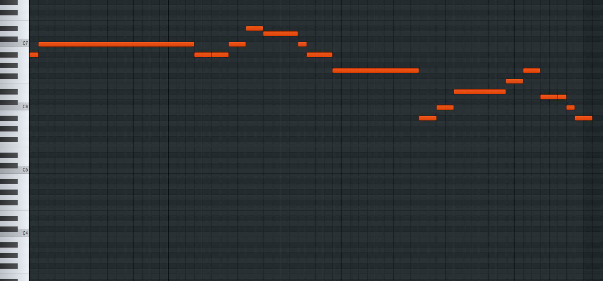
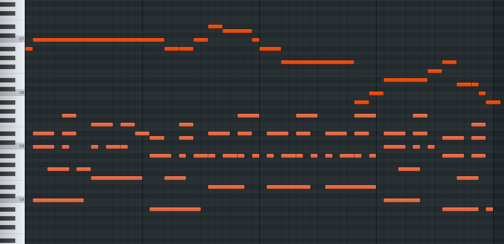

# MIDI generation with NLP techniques
An encoder Tranformer with RoPE trained as a masked diffusion model (MDM) to generate an accompaniment given a melody in MIDI format.

Code and training paradigms based on the recently published ["Scaling up Masked Diffusion Models on Text"](https://arxiv.org/abs/2410.18514) and ["Large Language Diffusion Models"](https://arxiv.org/abs/2502.09992).

Used model: num_layers: 12, d_model: 256, n_heads: 8, dim_ff: 1024, dropout: 0.1, bias: False
(The model could be larger with a better GPU, enabling improved generation.)

## Audio samples
Given melody

Generated accompaniment (melody + accompaniment)

Listen to audio samples here:
[Play real vs generated samples](https://ville383.github.io/MIDI_Language_modeling/)

## Training

1. preprocess MIDI data and train a tokenizer with BPE.
    - Use any existing MIDI dataset(s) to train a model. Modify the tokenizer settings to meet your needs. Currently Time Shift Duration (TSD) tokenizer is used.
3. Pre-train a model from scratch.
    - Token sequence: "BOS_None" token sequence "PAD_None"
4. Use supervised fine-tuning (SFT) to train the model to a specific task. (Accompaniment generation in this case.)
    - Token sequence: "BOS_None" "MIDI_Prompt" melody "MIDI_Answer" piano "PAD_None" ("PAD_None" ...)
    - Incude PAD_None in the loss calculation so the model learns to generate correct length token sequences. (An autoregressive model would stop generating after the first PAD_None.)
